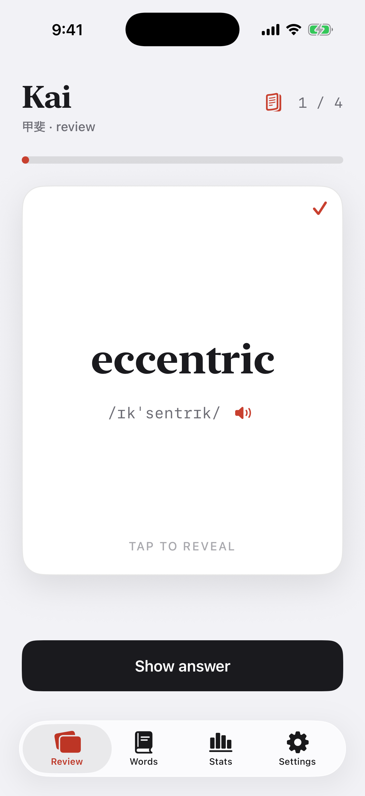
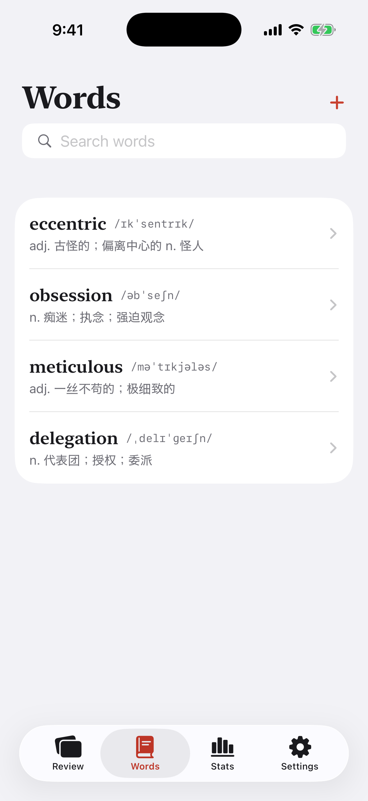
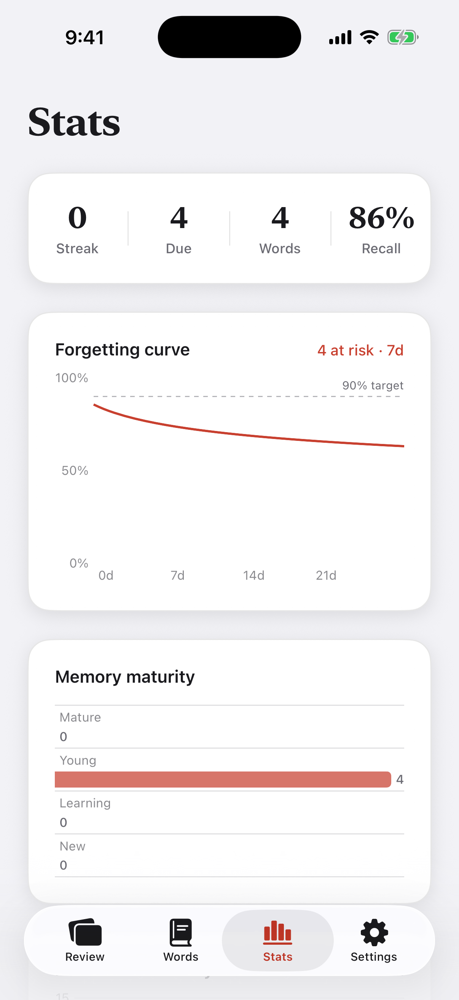

# Kai (甲斐)

A native Apple flashcard app for memorizing difficult vocabulary — English now, Japanese
later — built around **on-device AI card generation** and a **scientific spaced-repetition
memory model (FSRS-6)**. SwiftUI + SwiftData + Swift Charts, iPhone first.

The core idea: turn *hard memorization* into *efficient understanding*. AI enriches every
word (bilingual meaning, examples, mnemonics, etymology, roots, synonym groups,
collocations, a daily story), and an FSRS-based scheduler decides **what to review and
when** so you spend effort exactly where memory is about to fail.

## Screenshots

<p align="center">
  
  
  
</p>

<p align="center"><em>Review (FSRS flip card) · Words · Stats (forgetting curve, memory maturity)</em></p>

---

## The memory algorithm (FSRS-6)

Kai schedules reviews with **FSRS-6** (Free Spaced Repetition Scheduler), a modern,
open, empirically-validated successor to SM-2/Anki. Our implementation lives in the
dependency-free `KaiFSRS` package and is validated against the reference `ts-fsrs`.

### Memory model: three numbers per word

Each word carries an FSRS memory state:

- **Stability `S`** (days) — how long memory lasts; specifically, the time for recall
  probability to fall to 90%.
- **Difficulty `D`** (1–10) — how hard the word is to make stable.
- **Retrievability `R`** (0–1) — the probability you'd recall it *right now*, derived from
  `S` and the time elapsed since the last review.

### The forgetting curve

Recall decays as a **power forgetting curve**:

```
R(t) = (1 + factor · t / S) ^ decay
```

where `decay = −w[20]` and `factor = 0.9^(1/decay) − 1`, chosen so that `R = 0.9` exactly
when `t = S`. This is the curve drawn on the Stats dashboard (aggregated across the deck)
and used to compute the "at-risk in 7 days" count.

### From a rating to a schedule

After seeing the answer you self-rate **Again / Hard / Good / Easy** (grades 1–4). The
scheduler (`KaiFSRS.FSRSScheduler.review`) then:

1. **New word** → seed from the grade: `S₀(g) = w[g−1]`,
   `D₀(g) = clamp(w[4] − e^(w[5]·(g−1)) + 1, 1…10)`.
2. **Existing word** → update:
   - **Difficulty**: grade delta `ΔD = −w[6]·(g−3)`, damped toward 10, then mean-reverted
     toward the Easy-grade baseline (`w[7]`). Hard nudges D up, Easy nudges it down.
   - **Stability on success** (Hard/Good/Easy): grows more when difficulty is low, current
     stability is low, and retrievability was low (i.e. a hard-won recall teaches the most),
     with a Hard penalty `w[15]` and Easy bonus `w[16]`.
   - **Stability on lapse** (Again): drops to a small "post-lapse" stability, capped so it
     can't exceed a short-term-adjusted fraction of the old stability.
   - **Same-day re-review** (elapsed ≈ 0): a separate short-term-stability path; Good/Easy
     never reduce stability.
3. **Next interval**: the number of whole days until `R` falls back to the target retention
   (`requestRetention = 0.9`): `I(S) = (S/factor)·(0.9^(1/decay) − 1)`, clamped to
   `[1, 36500]` days.

`KaiCore.ReviewScheduler` bridges this pure algorithm to the persisted
`SchedulingState` (stability, difficulty, due date, last review, reps, lapses, learning
state). It is pure and deterministic — the caller passes `now` and persists the result.

### How a review flows through the app

```
SessionComposer  → interleaves up to N new words with all due-old words
      │             (new words spread among reviews aids retention)
      ▼
ReviewStore.rate → ReviewScheduler.next(state, rating, now)   ← FSRS update
      │             persists new SchedulingState + writes a ReviewLog
      ▼
dueAt mirror     → next session surfaces it when R decays to ~0.9
```

- **Quiz as a double-check.** A single-choice meaning quiz can follow a review group. It
  feeds the *same* scheduler — a correct answer counts as **Good**, a wrong answer as
  **Again** — so a word you *thought* you knew but missed on the quiz has its stability
  reset and comes due sooner. Quiz is intentionally **not** a separate tab; it's a
  reinforcement step after reviewing.
- **The rating buttons preview the schedule.** Each of Again/Hard/Good/Easy shows the exact
  next interval it would produce for the current card (computed live via FSRS), so the
  choice is informed rather than blind.
- **Stats makes memory visible.** The forgetting curve, memory-maturity distribution
  (new / learning / young / mature by stability), day streak, and the 7-day at-risk count
  all read straight from the FSRS state and review logs.

---

## Learning steps & scheduling behavior

Not-yet-graduated cards take short sub-day **learning steps** before FSRS day intervals:

- **Again → 1 min**, and the word is **re-queued into the current session** to drill again.
- **Hard → 10 min** (while still learning); on a graduated card, Hard keeps its FSRS day
  interval.
- **Good / Easy → graduate** to the FSRS day interval.

Elapsed time is floored to whole days, so same-day reviews (re-drills, the chained quiz,
multiple reviews in a day) use FSRS's short-term stability path (ts-fsrs behavior). Day
intervals get **fuzz** so cards scheduled together don't all fall due on the same day. A
**lapse** is counted only when a *graduated* word is failed. The chained quiz is a
**double-check**: a correct answer is a no-op, a wrong answer re-grades the word as Again.
Review sessions cap due words at 100 (most-overdue first) so a backlog stays bounded.

## Remaining limitations & open questions

- **Retention target is fixed at 0.9** and not user-tunable.
- **Weights are the stock FSRS-6 defaults — not personalized.** A per-user optimizer that
  fits weights from review history is planned but not built.
- **Forgetting-push notifications exist in `KaiServices` but aren't wired into the app yet.**
- **No iCloud sync.** Data is on-device only (the models are CloudKit-compatible, but sync
  is off), so deleting the app loses the deck.

---

## Architecture

Organized per the Tuist standard template (`Project.swift` + `Tuist/`); the Xcode
workspace is generated (`tuist generate`), not committed.

- **`kai-ios/`** — the SwiftUI app (module `KaiIos`, bundle `dev.tuist.kai-ios`, iOS 17+).
- **`Packages/`** — local Swift packages (the kernel, no UI):
  - **`KaiCore`** — SwiftData models, value types, `VocabularyRepository`, and
    `ReviewScheduler` (bridges `SchedulingState` ↔ FSRS). CloudKit-compatible modeling.
  - **`KaiFSRS`** — the pure FSRS-6 algorithm. Zero dependencies. Validated against ts-fsrs.
  - **`KaiAI`** — `LLMProvider` (Claude / OpenAI) over `URLSession` with structured output;
    generates cards, batched, and the daily story. Produces Codable DTOs, not SwiftData.
  - **`KaiServices`** — logging + in-app diagnostics, Keychain, notification scheduling,
    pronunciation, and (formerly) Vision OCR. Protocol + pure logic + thin platform adapter.
  - **`KaiUI`** — the design system (Ink & Paper palette + vermilion accent) and shared
    components (flip card, rating bar, toast).

The app is a `MainTabView` shell — **Review / Words / Stats / Settings** — over one
SwiftData store. Words are AI-generated from a paste field; a book button in Review opens
the **daily story**; Settings holds appearance, the review budget, pronunciation, the AI
provider/key, and a **Diagnostics** log viewer.

## Build / run / test

Requires Xcode 26.x + Tuist. Prefix commands with `export PATH="/opt/homebrew/bin:$PATH"`
if needed.

```bash
tuist generate                     # generate the Xcode workspace (after clone / manifest edits)

# Build & run in the simulator
xcodebuild build -workspace kai-ios.xcworkspace -scheme kai-ios \
  -destination 'platform=iOS Simulator,name=iPhone 17 Pro'

# Pure packages run on macOS (fast, no simulator)
swift test --package-path Packages/KaiFSRS
swift test --package-path Packages/KaiAI
swift test --package-path Packages/KaiServices

# KaiCore and the app suite MUST run on the iOS Simulator (SwiftData #Predicate)
(cd Packages/KaiCore && xcodebuild test -scheme KaiCore \
  -destination 'platform=iOS Simulator,name=iPhone 17 Pro')
xcodebuild test -workspace kai-ios.xcworkspace -scheme kai-ios \
  -destination 'platform=iOS Simulator,name=iPhone 17 Pro'
```

## Status

Kernel and app green: KaiCore 22 · KaiFSRS 23 · KaiAI 27 · KaiServices 24 · app 37.
On-device only (no iCloud sync yet). Design specs live in `docs/superpowers/specs/`.
