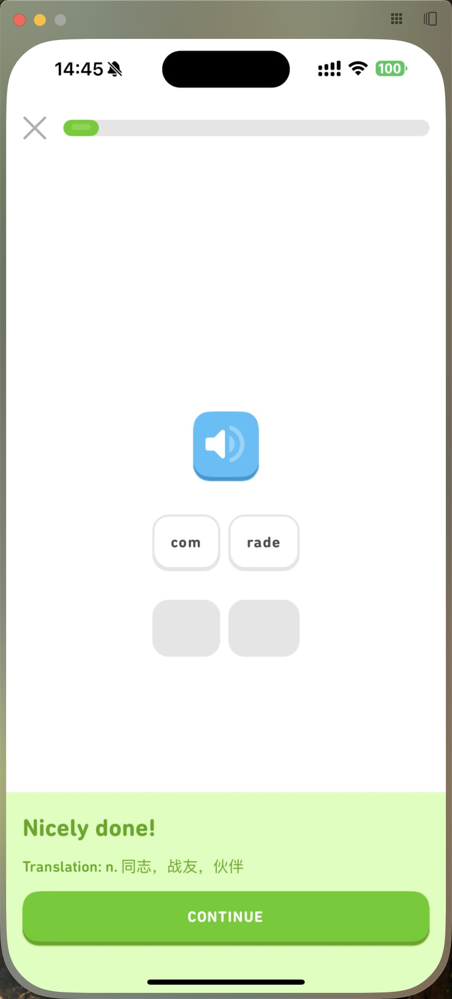

# Kai(甲斐)

[](https://prettier.io/)
[](https://github.com/YanceyOfficial/kai-monorepo/pulls)
[](https://nodejs.org/en/)
[](https://twitter/YanceyOfficial)

Flashcards APP using AI for learning words.

| Word                                            | Word Explanation                                            | Spilt Combine                                                 | Single Choice                                                 |
| ----------------------------------------------- | ----------------------------------------------------------- | ------------------------------------------------------------- | ------------------------------------------------------------- |
|  |  |  |  |

## Introduction

Gathering words that you can't recognize and using AI to generate their Chinese explanation, phonetic notation, examples, and quizzes. If you still can't recognize them by learning more times, Kai can sync them to the `challenging words` folder, and just learn them repeatedly until you totally recognize them. 😊

[Kai-monorepo](https://github.com/YanceyOfficial/kai-monorepo) is the repository for the CMS and Backend. (Because I have't found a way to integrate React Native project into monorepo. 😭)

## To start developing Kai

We have chosen [Expo](https://expo.dev/) and [React Native](https://reactnative.dev/) as our cross-platform base. Please follow their instructions to make sure that they are installed on your system.

### Environment Variables

```dash
KEYCLOAK_ISSUER=<YOUR_KEYCLOAK_ISSUER>
KEYCLOAK_CLIENT_ID=<YOUR_KEYCLOAK_CLIENT_ID>
KEYCLOAK_LOGOUT_URL=<YOUR_KEYCLOAK_LOGOUT_URL>
SENTRY_DSN=<YOUR_SENTRY_DSN>
SERVICE_URL=<YOUR_SERVICE_URL>
```

## Contributing

The main purpose of this repository is to continue to evolve Kai, making it faster and easier to use. Development of Kai happens in the open on GitHub, and we are grateful to the community for contributing bugfixes and improvements. Read below to learn how you can take part in improving Kai.

### [Code of Conduct](./CODE_OF_CONDUCT.md)

Kai has adopted a Code of Conduct that we expect project participants to adhere to. Please read [the full text](./CODE_OF_CONDUCT.md) so that you can understand what actions will and will not be tolerated.

### [Contributing Guide](./CONTRIBUTING.md)

Read our [contributing guide](./CONTRIBUTING.md) to learn about our development process, how to propose bugfixes and improvements, and how to build and test your changes to Kai.

### Good Issues

Please make sure to read the [Issue Reporting Checklist](./.github/ISSUE_TEMPLATE/bug_report.md) before opening an issue. Issues not conforming to the guidelines may be closed immediately.

## License

Kai is licensed under the terms of the [MIT licensed](https://opensource.org/licenses/MIT).
